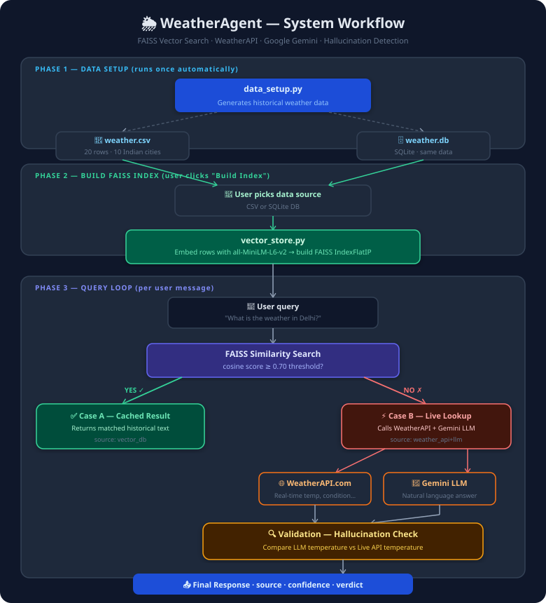

# 🌦️ WeatherAgent — Generative AI Weather Query System

> An intelligent AI-powered Weather Query Agent that retrieves weather information from CSV files or SQLite databases, stores and searches data using a FAISS vector database, and combines vector search, live weather APIs, and Google Gemini LLM to deliver accurate, context-aware weather responses through an agentic workflow.

🔗 **Live Demo:** [weather-gen-ai-agent.streamlit.app](https://weather-gen-ai-agent.streamlit.app)

---

## 🏗️ System Architecture & Workflow





---

## ✨ Features

- **Dual data source** — choose between CSV or SQLite at runtime
- **FAISS vector search** — fast semantic similarity matching on historical data
- **Live weather fallback** — WeatherAPI.com called when data isn't in the index
- **Gemini LLM responses** — natural language answers via `gemini-2.5-flash` (free tier)
- **Hallucination detection** — LLM temperature vs live API temperature compared automatically
- **Streamlit UI** — chat bubbles, live weather cards, validation panels
- **Deployed on Streamlit Cloud** — accessible from any browser, no setup needed

---

## 🗂️ Project Structure

```
weather_agent/
├── app.py              # Streamlit UI (main entry point)
├── agent.py            # Core agent logic (FAISS → API → LLM → validate)
├── vector_store.py     # Data loading, embedding, FAISS index
├── data_setup.py       # Generates weather.csv + weather.db
├── main.py             # CLI alternative (optional)
├── .env                # API keys (not committed)
├── .env.example        # Key template
├── .gitignore
└── requirements.txt
```

---

## 🔧 Tech Stack

| Layer | Technology |
|---|---|
| UI | Streamlit |
| Embeddings | `sentence-transformers` · `all-MiniLM-L6-v2` |
| Vector DB | FAISS (`IndexFlatIP` · cosine similarity) |
| LLM | Google Gemini 2.5 Flash (free tier) |
| Weather API | WeatherAPI.com (free tier) |
| Data | pandas · SQLite |
| Config | `python-dotenv` |

---

## 🚀 Local Setup

### 1. Clone the repo

```bash
git clone https://github.com/snairaadarsh/weather_agent.git
cd weather-agent
```

### 2. Create and activate a virtual environment

```bash
python -m venv venv

# Windows
venv\Scripts\activate

# Mac / Linux
source venv/bin/activate
```

### 3. Install dependencies

```bash
pip install -r requirements.txt
```

### 4. Configure API keys

Create a `.env` file (copy from `.env.example`):

```
WEATHER_API_KEY=your_weatherapi_key_here
GEMINI_API_KEY=your_gemini_api_key_here
```

| Key | Where to get it | Cost |
|---|---|---|
| `WEATHER_API_KEY` | [weatherapi.com](https://www.weatherapi.com) → Sign up | Free |
| `GEMINI_API_KEY` | [aistudio.google.com](https://aistudio.google.com) → Get API Key | Free |

### 5. Run

```bash
streamlit run app.py
```

Opens at **http://localhost:8501**

---

## 🌐 Streamlit Cloud Deployment

1. Push the repo to GitHub
2. Go to [share.streamlit.io](https://share.streamlit.io) → New app
3. Select your repo and set `app.py` as the entry point
4. Under **Advanced settings → Secrets**, add:

```toml
WEATHER_API_KEY = "your_weatherapi_key"
GEMINI_API_KEY  = "your_gemini_api_key"
```

5. Click **Deploy** — done!

> **Note:** On Streamlit Cloud, `load_dotenv()` is a no-op. Keys are read from Streamlit Secrets automatically via `os.getenv()`.

---

## 💡 How to Use

1. Open the app
2. In the sidebar, pick **CSV** or **SQLite DB** as the data source
3. Click **⚡ Build / Rebuild Index**
4. Type a weather query or click an example button
5. The agent will:
   - Return a cached result if the city is in the index → **📦 Vector DB**
   - Fetch live data + ask Gemini if not → **🌐 Live API + LLM**
   - Show a validation verdict comparing LLM vs API temperature

---

## 🔍 Agent Decision Logic

```
User query
    │
    ▼
FAISS similarity search
    │
    ├── score ≥ 0.70 ──▶ Return cached historical result
    │                    source: vector_db
    │
    └── score < 0.70 ──▶ WeatherAPI (live data)
                          + Gemini LLM (natural language)
                          + Validation (hallucination check)
                         source: weather_api+llm
```

### Validation logic

| Scenario | Result |
|---|---|
| LLM temp within ±5°C of API temp | ✅ **Accurate** |
| LLM temp differs by more than 5°C | ⚠️ **Possible Hallucination** |
| LLM didn't mention a temperature | ℹ️ **Unverified** |

---

## 📊 Historical Data Coverage

The built-in dataset covers **10 Indian cities** across **2 seasons**:

| City | Dates |
|---|---|
| Delhi, Mumbai, Chennai, Kolkata | Jan 2024 · Jun 2024 |
| Bangalore, Hyderabad, Pune | Jan 2024 · Jun 2024 |
| Jaipur, Ahmedabad, Lucknow | Jan 2024 · Jun 2024 |

Queries for cities **not in this list** (e.g. London, Tokyo) automatically trigger the live API + LLM path.

---

## 📦 requirements.txt

```
pandas
faiss-cpu
sentence-transformers
requests
google-genai
numpy
python-dotenv
streamlit
```

---

## 📄 License

MIT License — free to use, modify, and distribute.
